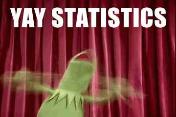

# Get help with RStudio

Congratulations! You have decided to use the world’s most popular statistical analysis software, R! R is a free software and a very powerful tool. It can be used simply as a calculator or to analyze data sets with billions of observations. Here you will find information about getting started with R and the fancy user interface RStudio. Check out the files, tutorials, and links below to help you out.

## Installing R and RStudio.

We typically use RStudio to write and execute code since it is nicer looking. But you need to first download R in order for everything to work smoothly.

[Download R](https://www.r-project.org/)

[Download RStudio](https://www.rstudio.com/)

[Use the Cloud (no download required)](https://rstudio.cloud/)

> If you would like more help and instructions to download both programs [read this](R_download_data_importing.pdf).

## RStudio in Stat 1090

These are some of the documents I have used in my Intro Stats classes. I expect my students to be able to perform this analysis in StatCrunch through MyStatLab, but not in RStudio. I give them an introduction to statistical coding and give them some basic tools. You may still see students ask about these techniques.

1. [Basic R Code](BasicRcode.pdf)
2. [Using R with the Normal Distribution](Rnormal.pdf)
3. [Survey Data](responses.csv)
4. [Survey Responses in RStudio](SurveyResponses.RData)

## After Stat 1090

### Tutorials
These are some tutorials that I have created for my more advanced classes. Feel free to look them over if you would like more  information about programming in R and RStudio.

1. [Introduction to R: Part 1](IntroR1_F18.pdf)
2. [Part 2](IntroR2.pdf)
3. [Part 3](IntroR3.pdf)
4. [Part 4](IntroR4.pdf)

> Here are some more technical guides based on the programming language
1. [Tutorial 1](RTutorial_1.pdf)
2. [Tutorial 2](RTutorial_2.pdf)
3. [Tutorial 3](RTutorial_3.pdf)

## More Tutorials and Help

I highly reccomend trying the [Swirl](http://swirlstats.com/) tutorial in RStudio to get hands-on practice.

If you want to learn to code, but not quite ready to do it in RStudio, try [DataCamp](https://www.datacamp.com/courses/free-introduction-to-r)

Also, consider Googling "How to _________ in R". There are tons of resources online with examples of code.

Contact me if you have any questions. jmroith@stkate.edu

### Have fun with RStudio!!

